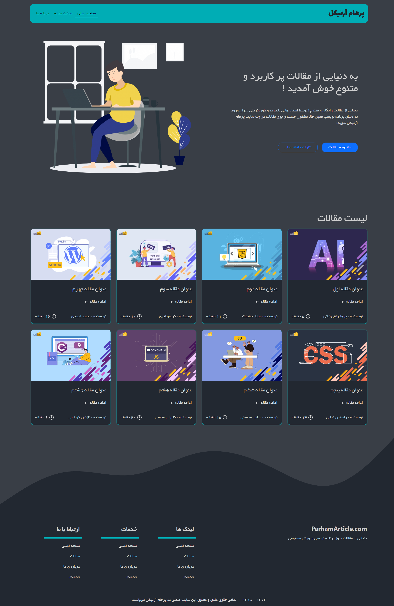
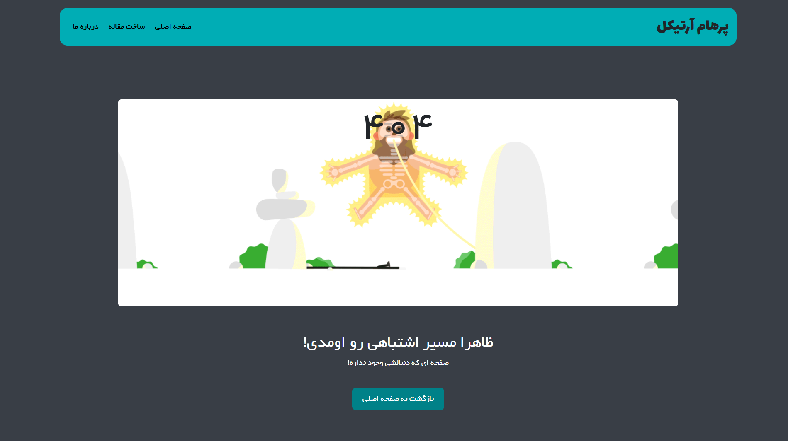

<p align="left">

🌐 **زبان:** فارسی [🇺🇸 English](./README.md) | 🇮🇷

</p>

---

# 📰 ArticleHub

<p align="center">
  <h3 align="center">اپلیکیشن مدیریت مقالات با React و Vite</h3>

  <p align="center">
    یک وب‌اپلیکیشن مدرن برای ایجاد، مشاهده، ویرایش و حذف مقالات با طراحی زیبا، معماری کامپوننت‌محور و رابط کاربری کاملاً واکنش‌گرا.
  </p>
</p>

---

## 📸 پیش‌نمایش

### 🏠 صفحه اصلی



---

### 📖 صفحه مقاله


---

### ➕ افزودن مقاله


---

### ✏️ ویرایش مقاله


---

### 👨‍💻 درباره ما


---

### 🚫 صفحه 404



---

# ✨ امکانات

- 📄 مشاهده لیست تمامی مقالات
- 📖 مشاهده جزئیات هر مقاله
- ➕ افزودن مقاله جدید
- ✏️ ویرایش مقالات
- 🗑️ حذف مقالات
- 📱 طراحی کاملاً Responsive
- ⚡ عملکرد سریع با Vite
- 🌐 ارتباط با REST API توسط Axios
- 🛣️ مسیریابی سمت کلاینت با React Router
- 💬 پیام‌های تأیید و هشدار با SweetAlert2
- ⏳ نمایش Loading هنگام دریافت اطلاعات
- 🔢 شمارنده‌های متحرک با PureCounter
- 🚫 صفحه اختصاصی 404
- ⬆️ اسکرول خودکار به ابتدای صفحات
- 🎨 ساختار کامپوننتی و قابل توسعه

---

# 🛠 تکنولوژی‌های استفاده شده

| تکنولوژی         | کاربرد                 |
| ---------------- | ---------------------- |
| React 19         | توسعه رابط کاربری      |
| Vite             | Build Tool             |
| React Router DOM | مسیریابی               |
| Axios            | ارتباط با API          |
| Bootstrap 5      | طراحی رابط کاربری      |
| React Bootstrap  | کامپوننت‌های Bootstrap |
| React Icons      | آیکون‌ها               |
| SweetAlert2      | پنجره‌های هشدار        |
| JSON Server      | شبیه‌سازی REST API     |
| PureCounter      | شمارنده‌های متحرک      |

---

# 📂 ساختار پروژه

```text
src
│
├── assets
│
├── components
│   ├── Article
│   ├── ArticleItem
│   ├── Footer
│   ├── HeroSection
│   ├── Loading
│   ├── Navbar
│   ├── NotFound
│   ├── PureCounter
│   └── ScrollToTop
│
├── pages
│   ├── Home
│   ├── About
│   ├── Article
│   ├── AddArticle
│   └── EditArticle
│
├── routes.jsx
├── dbHttpAddress.jsx
└── App.jsx
```

---

# 🚀 راه‌اندازی پروژه

## دریافت پروژه

```bash
git clone https://github.com/Parham-Codes/ArticleHub.git
```

## نصب وابستگی‌ها

```bash
npm install
```

## اجرای پروژه

```bash
npm run dev
```

## اجرای JSON Server

```bash
npx json-server db.json
```

پروژه در آدرس زیر اجرا می‌شود:

```
http://localhost:5173
```

آدرس API:

```
http://localhost:3000
```

---

# 💡 مهارت‌های تمرین‌شده

- React Components
- معماری کامپوننتی
- React Router
- عملیات CRUD
- REST API
- Axios
- اعتبارسنجی فرم‌ها
- طراحی Responsive
- مدیریت خطاها
- Loading State
- ساختاردهی پروژه
- اصول Clean Code

---

# 🔮 قابلیت‌های قابل اضافه شدن

- 🔐 سیستم احراز هویت
- 👤 پروفایل کاربران
- ❤️ لایک مقالات
- 💬 بخش نظرات
- 🔎 جستجوی مقالات
- 🏷️ دسته‌بندی مطالب
- 🌙 حالت تاریک (Dark Mode)
- 📄 صفحه‌بندی (Pagination)
- ☁️ اتصال به بک‌اند واقعی با Node.js و MongoDB

---

# 📦 وابستگی‌ها

- React
- React Router DOM
- Axios
- Bootstrap
- React Bootstrap
- React Icons
- SweetAlert2
- JSON Server
- PureCounter

---

# 👨‍💻 توسعه‌دهنده

### پرهام تقی‌خانی

Front-End Developer

GitHub: https://github.com/Parham-Codes
Email: parhamtaghikhani.31@example.com

---

# ⭐ حمایت از پروژه

اگر این پروژه برایتان مفید بود، با دادن یک **Star ⭐** در GitHub از آن حمایت کنید.

این کار انگیزه‌ای برای توسعه پروژه‌های بیشتر خواهد بود.
